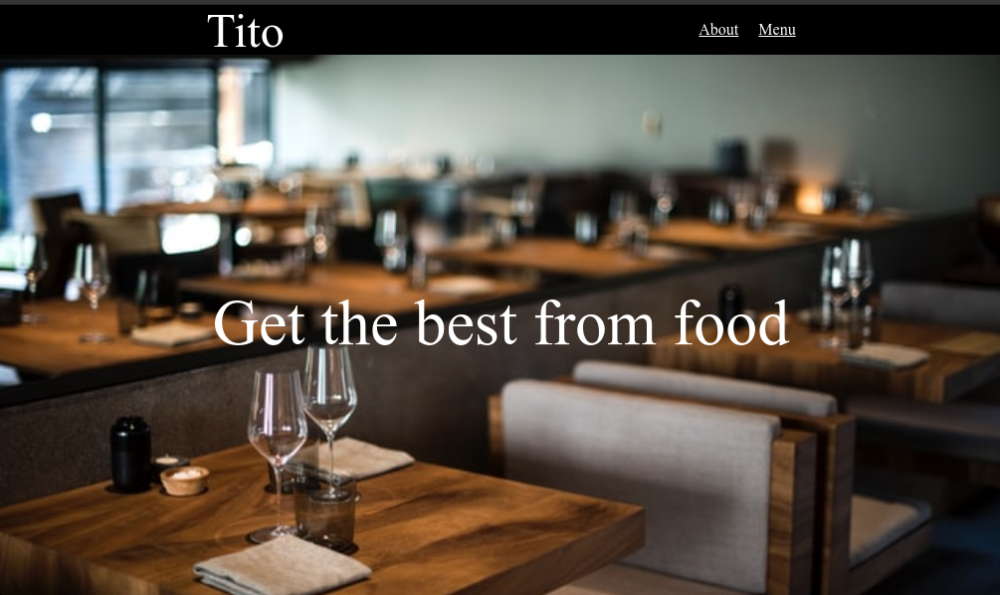

# Restaurant-Page

### Simple page restaurant for setup webpack. The page has simple navbar with 2 links and 2 sections.

.

### purpose

- Setup webpack.

### Live version

[live version](https://simple-restaurant-40.netlify.app/)

### How to run this project

- First: clone the repo and open the folder.
- Make sure you have npm installed localy then run `npm install` and `npm start`.

### Author

👤 **Ammar El refay Kandel**

- GitHub: [ammarkandel](https://github.com/ammarkandel)
- Twitter: [@AmmarQandel](https://twitter.com/AmmarQandel)
- LinkedIn: [LinkedIn](https://www.linkedin.com/in/ammar-kandel-7b4100193/)

### Contributing

This is a project for educational purposes only. We are not accepting contributions.

### Show your support

Give a ⭐️ if you like this project!
